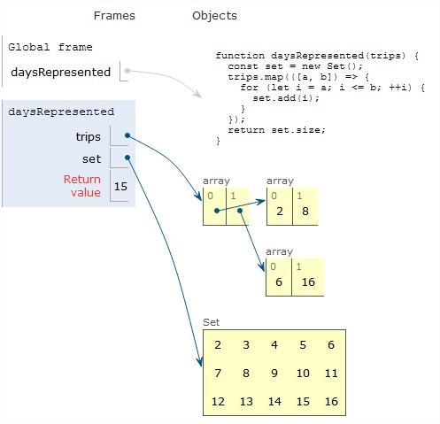
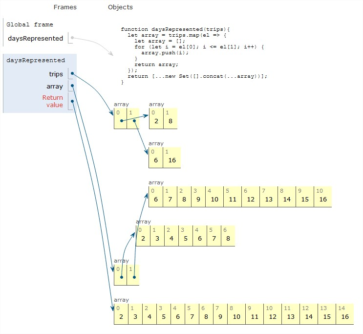

# [To Count How Many Days You Work Aboard](https://www.codewars.com/kata/58e93b4706db4d24ee000096)

From the title, we can see that this function can be handy for applications that related to employee management. Here the problem is to count how many days we spend on trips abroad to represent our company, thus the name of function and parameters are made to be related to this problem (it can be changed though as needed).

The interesting behavior for this function is: **it does not count the same input or value TWICE**, so do not use this for counting your profit or cost. But I am pretty sure, it will be useful for some other apps as well, for examples to count sick days, or in Operation to count how many type of product (not quantity) that we need to remodel.  

Any apps, as long as it requires to count one exact thing once, thus **there are NOT multiple elements with the SAME value in the array**.

## Syntax

> daysRepresented([`array`]) -> `number` 

```
*daysRepresented* ( *trips* ) -> *return value*   
*name of  function* ( [[*first day of trip*, *last day of trip*], [*first day of trip*, *last day of trip*], ...] ) -> *total of days*
```

### Parameters

**first day of trip**: `number`

- days are counted out of 365 days, for example 1 February = 32th day -> first day will be 32

**last day of trip**: `number`

- days are counted out of 365 days, for example 5 February = 36th day -> last day will be 36

### Return Value: `number`

- Total of days spent abroad that is accumulative of all trips.

## Examples

This function behaves like a loop way where it goes through the function again (starts from arg 1) and again until it gets to a certain condition (ends at arg 2). On the process it records each day from the marked first day to the marked last day and then it results in a total of days.

As mentioned before, it records a day (value) once. Logically, there is no 2 times of 1 February (day 32) in a year, thus the function only records that day one time. 

If arguments are inside of array of : 

```js
let firstTrip = [2,8];
const daysOfirstTrip = daysRepresented([2,8]);
console.log(daysOfirstTrip); // 2, 3, 4, 5, 6, 7, 8 -> 7 (days)
```

```js
let secondTrip = [6,16];
const daysOfSecondTrip = daysRepresented([6,16]);
console.log(daysOfSecondTrip); // 6, 7, 8, 9, 10, 11, 12, 13, 14, 15, 16 -> 11 (days)
```

```js
const totalDaysOfAllTrips = daysRepresented(firstTrip, secondTrip);
console.log(totalDaysOfAllTrips);
// 2, 3, 4, 5, 6, 7, 8, 9, 10, 11, 12, 13, 14, 15, 16 -> 15 (days)
```

---

> analyze a user's solution to this challenge

## [gkucmierz](https://www.codewars.com/users/gkucmierz)

```js
function daysRepresented(trips) {
    const set = new Set();
    trips.map(([a, b]) => {
      for (let i = a; i <= b; ++i) {
        set.add(i);
      }
    });
    return set.size;
  }
```

### Strategy

Gkuzmierz solved the problem by modifying the variable _trips_ and using _for loop_ to get the result. He also created a new array called **set** for the return value and he chose to do so with _Set_.  

The _return value_ comes out as **one solid array containing all days spent abroad** because he gave the return value to Set.



### Implementation

`new Set() (built-in object)`: The Set object lets us store one unique value (no multiple value, 1 is only recorded once) in the whole array. We can create the array from one element of a collective elements whether they are same or mixed data types (ex. only numbers or strings or mixed of both), as explain on MDN. 

Here the dev creates a new Set Object so where she/he can store the return values both from the inner function _(function from .map)_ or the outer function _(dayRepresented)_.

`.map() (methods in Array)`: With _.map_ we can call a variable and modify it with a new function.  

Here we can see the developer modified the variable trips using _.map_ by elaborating it with two parameters of array [a, b]: a (first day of trip), b (last day of trip) and followed by a function containing a loop that uses those two parameters, and a statement _(.add)_ to return the value for this inner function. 

`for loop`: Here he used the for loop with a set-up (i = a) using argument a (first day of trip), a condition (i <= b) using argument b (last day of trip), and ane expression (i++) to increase to the next indexes within the range between the setup and the condition. 

`.add() (method, paired with Set)`: As a statement for the function from _.map_, he used method _.add_ which added the values executed to the _set_.  

It looks similar to _.push_ in a normal array, but _.add_ works with _Set()_.

`.size (property, paired with Set)`: As a statement for the function _dayRepresented_, he used a property from Set called _.size_. It works similarly like _.lenght_ in the normal array.


### Possible Refactors

This strategy could also be implemented with these Implementation ...

- A separated total of each trips instead of a grand total of all trips together, that would be handy to use for another occasion.

---

> analyze another user's solution to this challenge

## [igolovko](https://www.codewars.com/users/igolovko)

```js
  function daysRepresented(trips){
    let array = trips.map(el => {
      let array = [];
      for (let i = el[0]; i <= el[1]; i++) {
        array.push(i);
      }
      return array;
    });
    return [...new Set([].concat(...array))].length;
  }
```

### Strategy

Similar to previous user, Igolovko also used _.map()_, _loop_ and _Set()_. She/he first created a new variable called **array** that references to the value inside _trips_ and modify it directly with _.map()_.

She/he managed to create two return values: first, **a loop from each trip has its own array** because he returned *array* at the end of function created by using _.map()_; second, a grand total days of all trips as  **one solid array containing all days spent abroad** from a sum using _.concat()_ in a Set.



### Implementation


`.map() (method in Array)`: Here we can see the developer modified the variable trips using _.map()_ by elaborating it with _one parameter named el_ and a function containing a loop. He also specify the variable **array** to contain the return values from each executed _el_.

`for loop`: Using the parameter el, loop went through the specified indexes of el which is _el[0]_ for first day of trip as the default setting, and _el[1]_ for last day of trip as condition. And also incremented forward to the next values between set up index and condition index. 

`.push() (method in Array)`: this method is used **as the statement in the loop** and it is used to record the value that has been executed (i) by each loop. Here the value is added to the array named **array**. 

`return array`: The developer used this **as the statement for the function made from .map()**. As the result, the return the value from executing each _el_ (ex: loop of [2, 8] and [6, 16]) is placed in separated arrays.

`... (spread syntax)` : She/he used this because he combined `new` in _Set()_. To call another function inside it (the function containing .concat(... array)), she/he need the spread syntax to do so. Check MDN. I am not really sure.

`new Set([]) (built-in object)`: It is found within **the statement for function _dayRepresented_**. Here the developer used this to create one set of socket (of array []) to hold values from the return value from each trip: el[2, 8] and el[6, 16]. It will also automatically only record unique value (no multiple value in the array).

`.concat() (method in Array)`: Here, after creating the array, she/he wanted to modify it with _.concat()_. She/he used this method to combine those two separated (returned values of each el) arrays into one, so that she/he could place it to the _new Set()_ as one long array containing all the days spent abroad from all trips.

`.length (property array)`: Since he already made a new array, he could now return this property to count how many values are stored there. 


### Possible Refactors

This strategy could also be implemented with these Implementation ...

- nothing I can think of. It's just better if the last return is coded a little cleaner, because there is too many things nestled all together in one syntax :)

---

## Notes

This is such an interesting problem and amazing solutions to study on, I learned a lot from their codes: new methods, built in object? etc. But I am not sure I can do similar codes alone without looking up to an example like this.

